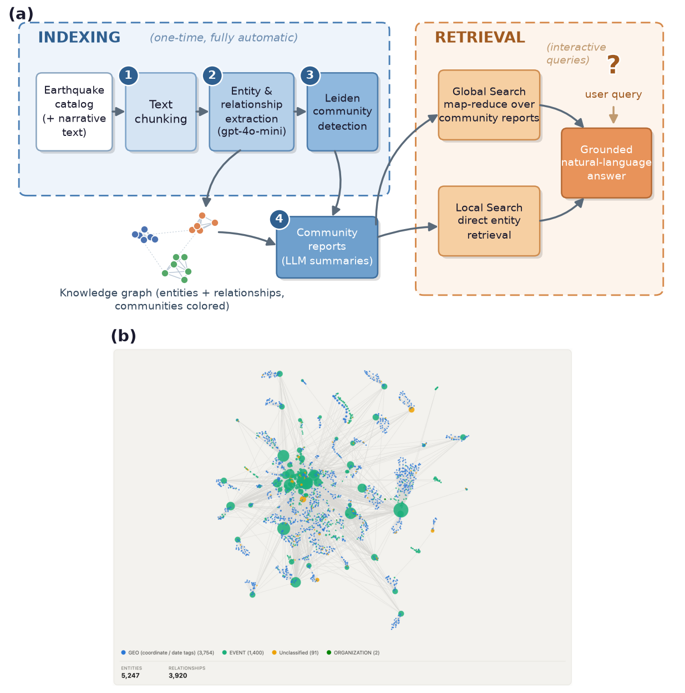

<div align="center">

# Automatic knowledge-graph construction and natural-language query for earthquake catalogs

Yuxin Zhou · Huai Zhang · S. Mostafa Mousavi

[](#)
[](https://doi.org/10.5281/zenodo.21459373)
[](https://github.com/microsoft/graphrag)
[](#)

</div>

---

Raw catalog rows in, a queryable knowledge graph out. No schema, no extraction rules.
Three catalogs, two prompt sets, one held-out test, 1,500 scored answers.

<p align="center">
  
  <br>
  <sub><b>Fig. 2 of the paper.</b> (a) Indexing and retrieval pipeline. (b) The graph GraphRAG builds from the Qiaojia catalog with no hand-designed schema: 5,247 entities, 3,920 relationships.</sub>
</p>

| | Qiaojia-Dongchuan | Ridgecrest 2019 | Maduo 2021 | Luding 2022 |
|---|:---:|:---:|:---:|:---:|
| events | 5,218 | 4,188 | 10,621 | 8,061 |
| role | development | development | development | **held-out** |
| conditions | catalog · +narrative | catalog · +narrative | catalog · +narrative | catalog |

---

## What is here

```
ProjectC1_Graphrag/
│
├── seisKG_graphrag_<catalog>[_narrative][_v2]/     one GraphRAG workspace per index
│   ├── settings.yaml                               configuration  (_v2 = seismology prompts)
│   ├── prompts/                                    the 13 prompt templates of this run
│   └── input/                                      catalog as ingested
│
├── seisKG_graphragoutputs/paper/
│   ├── IEEEAccess-Revision9.21/Author's Response Files/   Main Manuscript.pdf · Supplementary_material.docx
│   ├── benchmark_*_raw.csv                          every answer, every system
│   ├── scoring/                                     per_answer_scores.csv, CIs, audit, held-out protocol
│   ├── graph_quality/                               graph audit vs catalog and rule-based reference graph
│   ├── residual_errors/                             residual hallucination rates
│   ├── gmt_maps/                                    Fig. 1 sources
│   └── zenodo_publish/                              staging copy of the Zenodo record
│
└── catalog/                                         Sichuan network catalog → Luding test set
```

Not included: index outputs and caches (regenerable), the scoring scripts (on Zenodo), the LaTeX project (Overleaf), and the third-party Ridgecrest and Maduo inputs.

---

## Rebuild an index

```bash
pip install graphrag==2.7.0                 # 3.x is not compatible with these configs
echo "GRAPHRAG_API_KEY=sk-..." > seisKG_graphrag_qiaojia_v2/.env
cd seisKG_graphrag_qiaojia_v2
graphrag index --root .
graphrag query --root . --method global "Which month contributed the highest maximum magnitude?"
```


## Rebuild the tables

Scripts live in the Zenodo record, folder `scoring/`, and run in order:
`ground_truth` → `prescreen` → `judge --pass 1|2` → `aggregate` → `error_rates` → `index_stats` → `make_figures`.
Graph metrics: `graph_quality/run_all.sh`. Every number in the paper, the SM and the data set is the same file read three ways.

---

## Headline results

| | default prompts | seismology prompts | vector-RAG |
|---|:---:|:---:|:---:|
| catalog-only mean (Qiaojia · Ridgecrest · Maduo) | 1.35 · 1.38 · 0.78 | **1.39 · 1.51 · 1.27** | 1.44 · 1.49 · 1.34 |
| impossible magnitudes (600 answers) | 43 | **0** | 0 |
| records represented as entities | 0.1–16 % | **97–99 %** | — |
| held-out Luding mean | 0.29 | **1.30** | 1.41 |

The prompt fixes remove the targeted fabrication modes on every catalog, including the one they never saw. Overall scores stay moderate and at parity with vector-RAG; precise statistics belong to deterministic queries.

---

<div align="center">

Data: [Zenodo 10.5281/zenodo.21459373](https://doi.org/10.5281/zenodo.21459373) · Qiaojia: [Zhou (2026)](https://doi.org/10.48550/arXiv.2607.19606) · Ridgecrest catalog: [Shelly (2020)](https://doi.org/10.1785/0220190309) · Maduo catalog: [Guan et al. (2024)](https://www.sciencedirect.com/science/article/pii/S0040195124002609)

</div>
